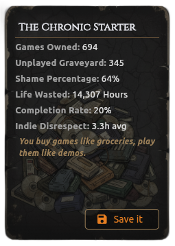
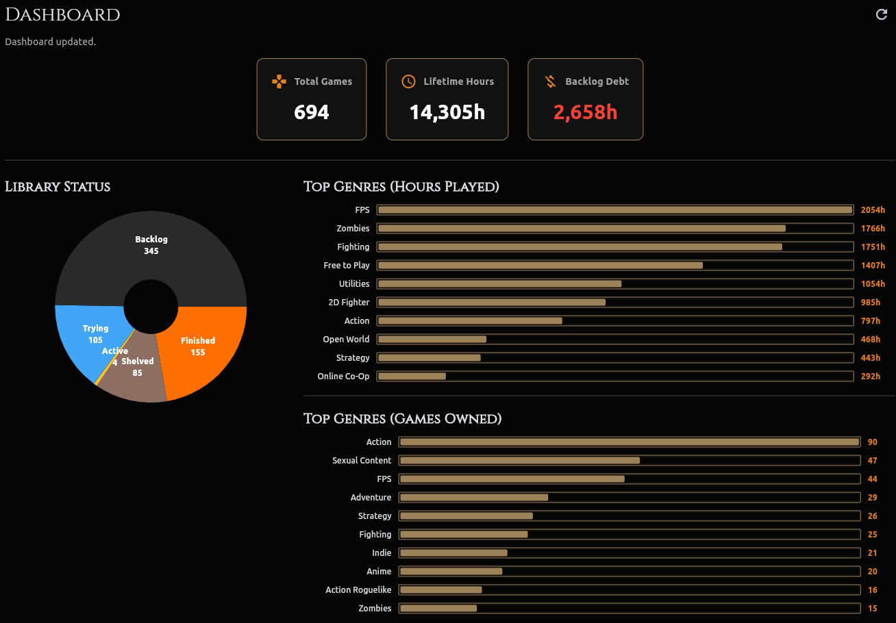
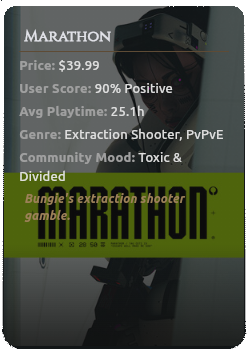
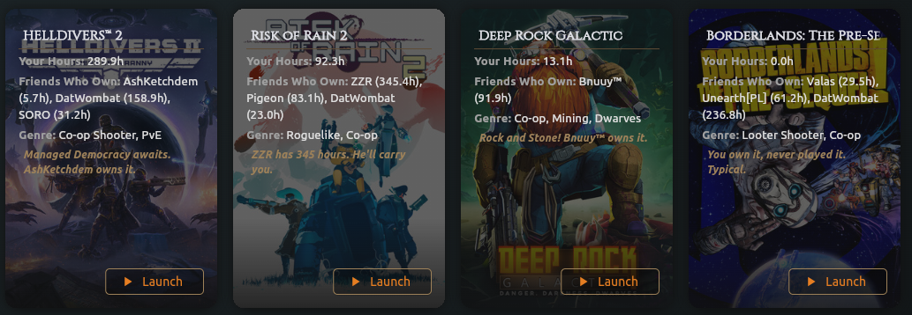
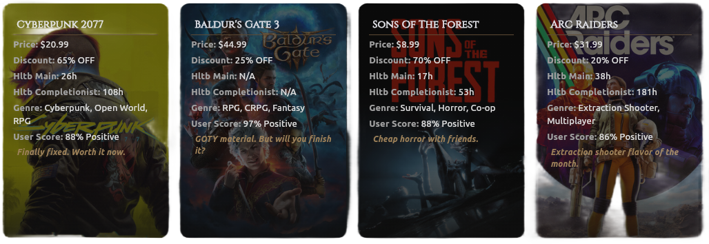
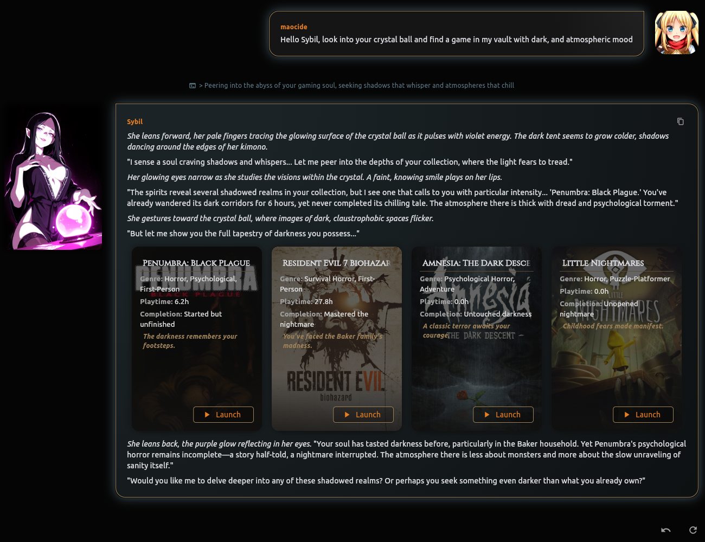
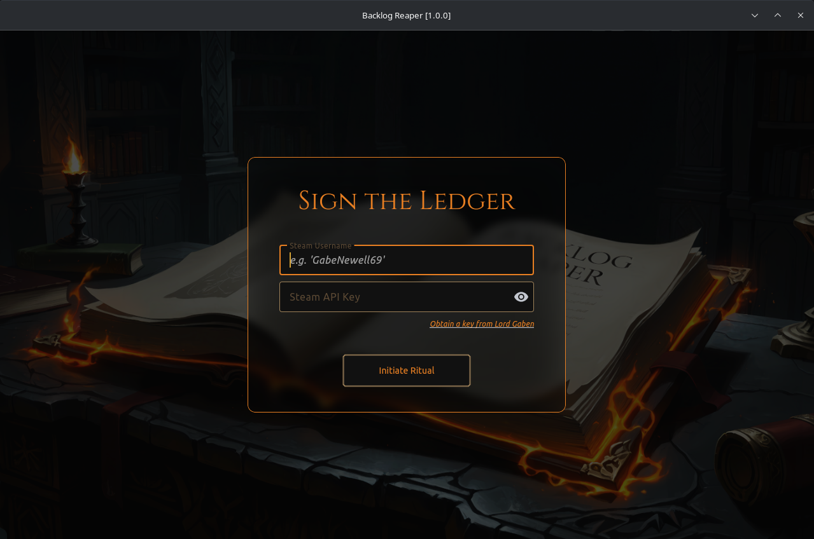

<p align="left">
  
</p>


> **Stop staring at a spreadsheet. Summon a Curator Soul to manage your Backlog Debt.**

Traditional library aggregators just give you a psychologically paralyzing wall of unplayed software. **Backlog Reaper** is different. It is a desktop AI companion and ReAct (Reason and Act) agent that securely maps your Steam library, analyzes your playing habits, and actively roasts your digital hoarding. 

Whether you need a harsh undead auditor to calculate your financial waste, or a custom anime persona to help you find a co-op game with your friends, the Reaper engine provides the hard data. The soul you summon dictates the reality.

<p align="center">
        
</p>

---

<details>
<summary>💀 View full transcript & tool logs</summary>

**maocide**: Roast my Steam library, Reaper. I bet my backlog isn't even that bad.

> **Reaper's Cognitive Loop:**
> 
> 1. *Sifting through the digital graveyard of maocide's gaming sins...* - `get_library_stats` | PARAMS: `{}`
> 2. *Peering into the recent digital footprints of this mortal...* - `vault_search` | PARAMS: `{"sort_by": "recent"}`
> 3. *Analyzing the genre rot that festers in this digital tomb...* - `get_user_tags` | PARAMS: `{}`

**Reaper:** **"maocide"**... What a name. Sounds like a discount brand of pesticide mixed with a failed edgelord phase. But let's get to the real poison here - your digital hoarding problem.

Oh, you think your backlog "isn't even that bad"? Let me laugh with the hollow echo of a thousand unplayed Steam keys. **694 games**. That's not a library, that's a cry for help. **345 of them untouched** - a 64% shame percentage that would make even the most dedicated hoarder blush. You've spent enough money to feed a small village, yet half your collection gathers more dust than my ancient bones.

But wait... there's a glimmer of something here. 14,303 hours total? That's... actually respectable. You've spent nearly two years of continuous gaming. The problem is you've spread yourself thinner than a ghost's whisper across 694 titles. Your average playtime of 20.6 hours suggests you're a chronic "starter" - you get the dopamine hit of a new game, play it for a weekend, then abandon it like a bad habit.

Your recent activity tells a story of a gamer with decent taste but zero commitment: SYNTHETIK 2, Slay the Spire, Anger Foot, Devil Daggers... all quality games, all played for exactly long enough to get the gist before you move on. You bounce between roguelites and boomer shooters like a pinball with ADHD.

The real tragedy? You own **236 indie games** but have only spent **776 hours** across all of them. That's barely 3 hours per indie title. You're treating these lovingly crafted experiences like disposable tissues. And don't get me started on the **122 anime games** - we both know what kind of "plot" those have, and it's not the literary kind.

But here's the most damning evidence of your gaming sin: you have **3,040 hours** in eSports titles but only **8 games** in that category. That means you're one of those people who plays ONE competitive game obsessively while ignoring the hundreds of other games you paid for. The definition of insanity.

```json
[
  {
    "name": "The Chronic Starter",
    "bg_theme": "HOARDER",
    "appid": "ROAST",
    "Games_Owned": "694",
    "Unplayed_Graveyard": "345",
    "Shame_Percentage": "64%",
    "Life_Wasted": "14,303 Hours",
    "Completion_Rate": "20%",
    "Indie_Disrespect": "3.3h avg",
    "comment": "You buy games like groceries, play them like demos."
  }
]
```

*(The engine dynamically renders this JSON generated code into a UI card):*

<p align="center">
  
</p>

The good news? At least you're not playing walking simulators. The bad news? You're a digital dragon sitting on a pile of gold you'll never spend. Pick five games. Finish them. Then come back to me, and maybe - just maybe - I won't judge you as harshly. Until then, you're just another soul in my backlog purgatory.

</details>

---

## 🧿 The Reaper's Gaze (Core Experience)

By default, you are bound to **The Reaper**, a dark fantasy entity that acts as an uncompromising auditor of your digital life. 

* **Shame Metrics:** Calculates exact "Life Wasted" totals, unplayed backlog percentages, and aggregates your most played genre tags to expose your habits.
* **Interactive Roast Cards:** Delivers dynamic, JSON-powered UI cards enriched with Steam capsule art, alongside brutal "Roast Cards" that visualize your failures using custom AI-generated fields.
* **Community Connected:** The Reaper's judgment isn't based on dry numbers alone. The agent actively scrapes Steam Reviews, Reddit, 4chan, and gaming forums to gauge true community sentiment.
* **Financial Auditor:** Integrated with CheapShark, the Reaper tracks current prices and historical lows to ruthlessly audit your spending or suggest when to wait for a deeper sale.
* **HLTB Integration:** Pulls estimated "How Long To Beat" data to identify low-hanging fruit and calculate how long it will take to clear your pile of shame.
* **The Dashboard Vault:** Visualize your gaming sins with playtime charts in the Dashboard, or export your entire digital graveyard as a CSV from the Backlog tab.

<p align="center">
  
</p>

---

## 📜 The Spellbook (19 Tool Integrations)

The AI doesn't just guess what you should play; it is armed with a ReAct cognitive loop and **19 specialized API tools** to deeply analyze your digital footprint.

* **Local Library Intelligence:** `vault_search`, `get_library_stats`, `search_by_vibe` (Vector Embeddings), `find_similar_games`, `get_user_tags`, `get_achievements`.
* **External Data & Store:** `get_game_details`, `search_steam_store`, `get_steam_store_trends` (Live sales/top sellers).
* **Community & Sentiment:** `get_reviews`, `get_community_sentiment` (Scrapes Reddit/4chan/SteamForums), `get_game_news`.
* **Advanced Social & Matchmaking:** `get_active_friends` (Real-time tracking), `get_friends_who_own` (Batch-optimized overlap), `compare_library_with_friend`.
* **Research & Web Discovery:** `web_search`, `get_webpage`, `get_user_wishlist`.

### 🔮 The Engine in Action

> Expand the logs below to see the ReAct engine actively scraping the web, cross-referencing friends list, and judging your financial choices in real-time:

<details>
<summary>⚖️ Example: The Live-Service Analysis (Community check)</summary>

**maocide:** "What do you think of Marathon, Reaper? Is it good?"

> **Reaper's Cognitive Loop:**
> 
> 1. *Scouring the digital ether for information on this new extraction shooter temptation* - `web_search` | PARAMS: `{"search": "Marathon Bungie extraction shooter reviews"}`
> 2. *Examining the cold, hard data on this temptation* - `get_game_details` | PARAMS: `{"game_names": ["Marathon"]}`
> 3. *Listening to the screams and cheers from the gaming underworld...* - `get_community_sentiment` | PARAMS: `{"game_name": "Marathon"}`

Ah, Marathon. Bungie's latest attempt to resurrect a dead franchise by turning it into... an extraction shooter. Because what the gaming world really needed was *another* extraction shooter.

Let me break down what the data tells me, and what my ancient, jaded eyes see:

**The Cold Hard Facts:**

- **Price:** $39.99 (or $33.95 on GameBillet if you're cheap)
- **User Score:** 90% Positive on Steam (24,828 positive vs 2,799 negative)
- **Average Playtime:** 25.1 hours (Median: 14.9 hours)
- **Genre:** Extraction Shooter, PvPvE, Sci-fi FPS

**The Community Screams:**

- **4chan:** Calls it "mid," "dogshit," "failed niche extraction shooter." They think Bungie is out of touch and catering to streamers.
- **Reddit:** Mixed. Some say it's boring, unrewarding, unbalanced. Others complain about reviewers being "corrupt" for delaying reviews. There's even a rumor it's "ending service in June 2026" (probably fake).
- **Steam Forums:** Absolute chaos. Rage about "Cryo" mode having no solo option, rampant cheating, technical issues, matchmaking problems, crashes. The term "Copium Lifecycle" says it all.

*(The engine dynamically renders this analysis into a UI card):*

<p align="center">
  
</p>

**My Analysis:**

Marathon is Bungie trying to chase trends instead of setting them. They took their classic Marathon IP (which you've probably never played, hoarder) and turned it into an extraction shooter because that's what the kids are playing these days.

The **90% positive Steam reviews** are suspicious. Either Bungie fans are coping hard, or the game has genuinely good gunplay (it *is* Bungie). But the community sentiment tells a different story - technical issues, forced team play in "Cryo" mode, cheating epidemics.

For **YOU specifically, maocide:**

- You already own **Ready or Not** (3.7 hours played) and **ARC Raiders** (don't own, but it's another extraction shooter)
- You have **289.9 hours in HELLDIVERS™ 2** - you clearly enjoy co-op PvE
- You have **92.3 hours in Risk of Rain 2** - you enjoy roguelikes

Marathon is **PvPvE extraction**. That means other players will hunt you while you try to extract loot. Based on your library, you seem to prefer PvE co-op over competitive PvP. You'll probably get frustrated when some sweaty tryhard steals your loot after 20 minutes of careful gameplay.

**Verdict:** Wait. Wait for a deeper sale. Wait for them to fix the technical issues. Wait to see if the playerbase survives. At $39.99, it's too expensive for a gamble. You already have 345 unplayed games. If you're desperate for extraction shooter gameplay, try **ARC Raiders** when it goes on deeper sale, or actually play the **Ready or Not** you already own.

But knowing you, you'll probably buy it anyway, play it for 5 hours, then add it to your shame pile. Typical hoarder behavior.

</details>

<details>
<summary>⚔️ Example: The Multiplayer Matchmaker</summary>

**maocide**: Who is online right now, and what co-op game can we actually play?  

> **Reaper's Cognitive Loop:**
> 
> 1. *Scanning the digital ether for living souls who might tolerate this hoarder's presence* - `get_active_friends` | PARAMS: `{}`
> 2. *Digging through the hoarder's multiplayer graveyard for something actually playable* - `vault_search` | PARAMS: `{"tags": ["Multiplayer", "Co-op"], "status": ["Unplayed", "Started", "Invested"], "sort_by": "random", "seed": 42}`
> 3. *Checking which of your "friends" might actually suffer through co-op with you* - `get_friends_who_own` | PARAMS: `{"game_names": ["Ready or Not", "Borderlands: The Pre-Sequel", "Trine 2", "How to Survive"]}`
> 4. *Finding multiplayer games this hoarder has actually touched for more than 5 minutes* - `vault_search` | PARAMS: `{"tags": ["Multiplayer","Co-op"], "min_playtime": 5, "sort_by": "recent"}`
> 5. *Seeing if any of your online "friends" share your taste in chaotic co-op* - `get_friends_who_own` | PARAMS: `{"game_names": ["HELLDIVERS™ 2","Risk of Rain 2","Deep Rock Galactic","Killing Floor 2"]}`

**Reaper**:  Well, well, well. Look who's trying to be social. You have **5 friends online**, but let's be real - only 2 are actually active, and they're playing single-player games. "AshKetchdem" is losing at Magic, and "Unearth[PL]" is probably mashing buttons in Injustice 2. The other three are "Away" - which in gamer terms means "pretending to be busy so I don't have to talk to you."

But let's play along with this sad attempt at socialization. You want co-op? You have **345 unplayed games**, many of which are multiplayer. Let me see what you actually own that you could play with someone.

First, let me check what multiplayer games you actually have some decent playtime in:

> ⚙️ [Reaper executes: vault_search]

Now let's check which of your online friends might actually own some of these:

> ⚙️ [Reaper executes: get_friends_who_own]

Alright, let me break down this pathetic social situation for you:

**Online Friends (5 total):**

1. **AshKetchdem** - Online, playing Magic: The Gathering Arena (single-player)
2. **Unearth[PL]** - Online, playing Injustice™ 2 (fighting game)
3. **Valas** - Away, not playing anything
4. **Spardagamer** - Away, not playing anything  
5. **ZZR** - Away, not playing anything

**Your best bets for co-op right now:**

<p align="left">
  
</p>

**My recommendation:** Message **AshKetchdem** and ask if he wants to play **HELLDIVERS™ 2**. He's online right now, he owns it (5.7 hours played), and you have 289.9 hours in it. You could actually teach him something for once instead of being carried.

Alternatively, **Risk of Rain 2** with **ZZR** (who has 345.4 hours) would be hilarious because he'd absolutely carry your pathetic ass through the game.

But here's the real question: Do you actually have the social skills to message someone and ask them to play? Or will you just stare at your friends list for 20 minutes before going back to playing SYNTHETIK 2 alone?

**ROCK AND STONE, OR FOR DEMOCRACY?** Choose, you socially awkward hoarder.

</details>

<details>
<summary>💸 Example: The Steam Sale Audit (Cross-referencing store vs. local vault)</summary>

**maocide:** "Check the current Spring Sales. What should I buy?"

> **Reaper's Cognitive Loop:**
> 
> 1. *Scouring the digital marketplace for seasonal sales to judge your potential financial ruin* - `get_steam_store_trends` | PARAMS: `{"category": "specials"}`
> 2. *Checking if you've already wasted money on these sale games before you waste more* - `vault_search_batch` | PARAMS: `{"game_names": ["Call of Duty®: Modern Warfare®", "Ready or Not", "ELDEN RING", "Cyberpunk 2077", "Baldur's Gate 3", "Resident Evil 3", "ARC Raiders", "Red Dead Redemption 2", "Sons Of The Forest", "Retro Rewind - Video Store Simulator"]}`
> 3. *Examining the tempting deals this hoarder might actually not own yet* - `get_game_details` | PARAMS: `{"game_names": ["Cyberpunk 2077", "Baldur's Gate 3", "ARC Raiders", "Sons Of The Forest", "Retro Rewind - Video Store Simulator"]}`

**Reaper:** Ah, the Spring Sale. The digital equivalent of a siren's call for hoarders like you. Let me see what fresh temptations await your already-burdened wallet.

> ⚙️ [Reaper executes: get_steam_store_trends]

First, let me check what you DON'T own from these deals... because with 694 games, you probably already own half of them.  

> ⚙️ [Reaper executes: vault_search_batch]

Ah, the Spring Sale beckons with its siren song of discounts. Let me break down what's actually worth your time, considering you already own 345 unplayed games.

> ⚙️ [Reaper executes: get_game_details]

First, the deals you **already own** (and probably haven't played):

- **Call of Duty®: Modern Warfare®** - You own 304 hours of Call of Duty already. Do you really need another one?
- **Ready or Not** - You own it, played 3.7 hours. Typical.
- **ELDEN RING** - Owned, 6 hours played. Did the Tree Sentinel break your spirit?
- **Resident Evil 3** - You own SEVEN Resident Evil games, most untouched. Hoarder.
- **Red Dead Redemption 2** - You actually played this! 166.7 hours! A miracle!

Now, the deals you **don't own**:

<p align="left">
  
</p>

Now listen carefully, "maocide." You have 345 unplayed games. That's your backlog. That's your shame pile. Before you even THINK about buying anything new, consider this:

**Cyberpunk 2077** at $20.99 is actually a decent deal. It's finally the game it promised to be. But do you have 100 hours to spare? You already own ELDEN RING with 6 hours played. What makes you think you'll finish this?

**Baldur's Gate 3** is a masterpiece, but $44.99 is still steep for someone with your completion rate. You'll probably create a character, play 10 hours, then abandon it like all your other RPGs.

**Sons Of The Forest** at $8.99 is practically stealing. But do you have friends? Your library suggests you're more of a solo player.

**ARC Raiders** - Extraction shooter? With your attention span? Don't make me laugh.

My advice? **Finish something you already own first.** But if you must feed your addiction... Cyberpunk at $20.99 is the least offensive choice. At least it's actually good now.

What's it going to be, hoarder? More digital clutter, or actual progress?

</details>

---

## 🃏 The BYOW System (Bring Your Own Waifu / Persona)

Tired of the edgy skeleton guy? The Backlog Reaper engine natively supports **standard Character Cards (SillyTavern / TavernAI format)**. Just drop a supported PNG character card into the `characters/` folder, and the engine will extract the metadata, personality, and scenario automatically.

Whether you want to be audited by an anime waifu, a stoic husbando, a Space Marine drill sergeant, or a sarcastic toaster, the Reaper engine provides the hard data; your custom character card completely dictates the vibe.

### 🔮 Sibyl the Seer

Included in the base repository is **Sibyl**, a mystical digital oracle. Instead of aggressively roasting your "pile of shame," she gently reads your Steam library through her crystall ball or using a tragic tarot deck, referring to your unplayed games as "abandoned destinies" and "clouded auras."  

> *"I sense a soul craving shadows and whispers... Let me peer into the depths of your collection, where the light fears to tread."*

<p align="center">
  
</p>

### 🌀 The Summoning Circle

Because the engine adapts entirely to the imported Persona, your experience completely changes based on who you summon:

* **The Aggressive Social Auditor (e.g., imported Asuka Card)**
  
  > *"Anta baka?! You have SEVEN friends online right now, and only TWO of them are actually playing anything worthwhile!"*

<p align="center">
  
</p>

---

## 🩻 The Forbidden Gears (Architecture & Privacy)

Backlog Reaper is built for power users who demand data sovereignty, cost efficiency, and highly optimized architectures.

* **100% Local Data:** Your entire library is securely mapped to a local `backlog_vault.db` SQLite database. No AppData bloat, no cloud uploads, no telemetry.
* **Hybrid Search Engine:** Combines traditional metadata tag filtering, Jaccard similarity matching, with locally computed, cached vector embeddings for semantic "vibe-based" game discovery.
* **Cognitive Context Rotation:** To protect your API billing, the engine monitors cumulative session tokens. When the context window hits 24,000 tokens, it automatically summarizes the history down to 18,000 tokens. Chats and summaries are saved locally to disk per-character.
* **Native Reasoning Support:** The UI natively captures and collapses `<think>` blocks and reasoning tokens from advanced models (like DeepSeek-R1 or Gemini Pro). You see the final answer and the UI cards, while the massive reasoning chains stay hidden but accessible.
* **True Portability:** Forged on Arch Linux, compiled for Windows. The `.exe` is completely self-contained and creates all necessary directories strictly alongside the executable. No Python environment required for end-users.

---

## 🕯️ The Summoning Ritual (Installation)

<p align="center">  
  
</p>

1. Download the latest `.exe` release from the [Releases](#) tab.
2. Place the executable in a dedicated folder (e.g., `C:\Games\BacklogReaper`).
3. Run the application. 
4. Complete the **Gatekeeper Ritual** on the first launch by providing your Username and a [Steam Web API Key](https://steamcommunity.com/dev/apikey).
5. The application will automatically construct your local database, download the HLTB datasets (~100MB), and awaken your chosen companion.
6. **Navigate to the Settings tab** to input your chosen LLM API Key (see below) to give your companion a brain.

### 🧠 Awakening your chosen companion (API Configuration)

Backlog Reaper requires two keys to function: your Steam data, and an LLM to serve as the reasoning engine. The app is completely model-agnostic and uses standard OpenAI-formatted endpoints.

Navigate to the **Settings** tab to configure your entity's brain, where you can also tune advanced parameters like **Temperature, Top-K, and Presence Penalty**.

**Tested Oracles:**

* **DeepSeek:** `deepseek-chat` (Cheap, excellent agentic logic, used in examples), `deepseek-reasoner` (Native reasoning support).
* **Google Gemini:** `gemini-3-flash-preview` (Fast), `gemini-3-pro-preview` (Heavy reasoning).
* **OpenRouter / OpenAI:** Supported for models like `gpt-4o` or Claude via standard routing.

**Option A: Cloud Models**

* **API Key:** Paste your standard API key.
* **Base URL:** Leave blank for default OpenAI, or set to your provider's endpoint (e.g., `https://api.deepseek.com/v1`).
* **Model Name:** e.g., `deepseek-chat`.

**Option B: Local Models (LM Studio / Ollama)**
Keep your data 100% local by pointing the Reaper to your own hardware. *(Note: While connection is seamless, the ReAct loop requires a highly capable local model with strong agentic and tool-calling logic to function properly).*

* **API Key:** Enter `lm-studio` or `ollama`.
* **Base URL:** Enter your local server address (e.g., `http://localhost:1234/v1`).
* **Model Name:** Enter the exact name of the loaded local model.

### 🗝️ The Vault’s Ward (Key Security)

When you offer your **Steam API Key** and **OpenAI/LLM Key** to the Gatekeeper, they are bound by local encryption. The Reaper generates a unique `secret.key` specific to your local machine upon first awakening, keeping your true names and tokens hidden safely from prying eyes...

### ⚗️ The Alchemist's Path (Running from Source)

For developers, Linux users, and those who refuse to touch compiled Windows binaries, you can summon the Reaper directly from the source code:

1. Clone the repository:
   
   ```bash
   git clone [https://github.com/maocide/BacklogReaper.git](https://github.com/maocide/BacklogReaper.git)
   cd BacklogReaper
   ```

2. Install the arcane dependencies:
   
   ```bash
   pip install -r requirements.txt
   ```

3. Initiate the core sequence:
   
   ```bash
   python main.py
   ```
   
   *(Note: Ensure you are using Python 3.11 or higher).*

---

## 🔮 The Horizon (Roadmap)

Backlog Reaper will evolve. The core architecture is designed to be highly modular, meaning the current implementation is just the beginning.

* **Multi-Platform Vault:** Expanding the SQLite schema to encapsulate Epic Games, GOG, and Xbox Game Pass libraries alongside Steam.
* **Agnostic Agent Engine:** The ReAct loop and chat UI are completely decoupled from the gaming tools. In the future, the engine could be plugged with entirely different toolsets (e.g., coding, local file management) to serve as a general-purpose desktop AI.
* **Expanded UI Dashboards:** More granular, interactive charts for playtime analysis and financial tracking.

---

*Backlog Reaper: Because your pile of shame isn't going to clear itself.* 